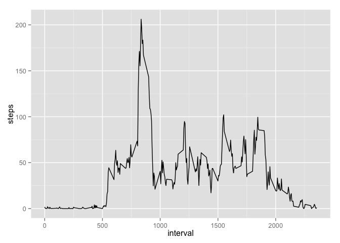
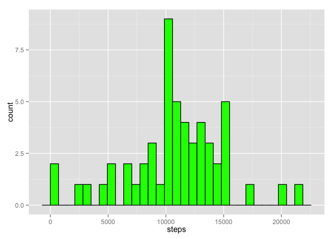

# Reproducible Research: Peer Assessment 1

## Loading and preprocessing the data
First of all, let's unzip our data to the simple *.csv file

```r
unzip("activity.zip")
```
Now we can read our dataset and save it to the variable **data**, identify date column as *date* and see the first rows of our table.

```r
data  <- read.csv("activity.csv")
head(data)
```

```
##   steps       date interval
## 1    NA 2012-10-01        0
## 2    NA 2012-10-01        5
## 3    NA 2012-10-01       10
## 4    NA 2012-10-01       15
## 5    NA 2012-10-01       20
## 6    NA 2012-10-01       25
```

## What is mean total number of steps taken per day?
Calculating the *sum* of the steps ped day and making a histogram using **ggplot2** for it.  

```r
library(ggplot2)
```

```
## Warning: package 'ggplot2' was built under R version 3.2.1
```

```r
totalStepsData  <- aggregate(steps ~ date, data, sum)
ggplot(totalStepsData, aes(x = steps))+
    geom_histogram(fill = "Green", colour = "Black")
```

 

Now we have the results for sum of the steps per day and can use it for evaluating the **mean** and **median** values.

```r
mean(totalStepsData$steps)
```

```
## [1] 10766.19
```

```r
median(totalStepsData$steps)
```

```
## [1] 10765
```


## What is the average daily activity pattern?
Calculating the *mean* of the steps per interval, make a plot for it and finding the interval with max activity in the "%H:%M" format 

```r
meanStepsData  <- aggregate(steps ~ interval, data, mean)
ggplot(meanStepsData, aes(x = interval, y = steps))+
    geom_line()
```

 

```r
format(strptime(as.character(meanStepsData$interval[meanStepsData$steps == max(meanStepsData$steps)] / 100), "%H.%M"), "%H:%M")
```

```
## [1] "08:35"
```


## Imputing missing values
Calculating the total number of missing values, creating the new dataset with using mean instead of *NA* values. Ploting the new hist.

```r
length(is.na(data$steps))
```

```
## [1] 17568
```

```r
newData  <- data
newData$steps  <- ifelse(is.na(data$steps), meanStepsData[meanStepsData$interval == data$interval,]$steps, data$steps)
newTotalStepsData  <- aggregate(steps ~ date, newData, sum)
ggplot(newTotalStepsData, aes(x = steps))+
    geom_histogram(fill = "Green", colour = "Black")
```

 


## Are there differences in activity patterns between weekdays and weekends?
